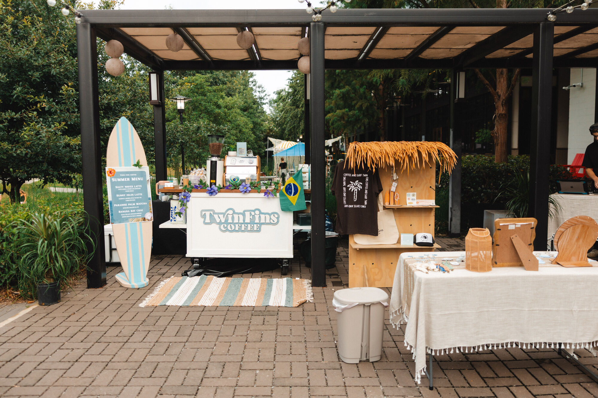

<div align="center">



# Twin Fins Coffee

**Paradise in every sip.**

A mobile coffee bar in Atlanta, GA — private events, activations, and the
occasional film set. This is the source for its website.

<sub>

`Next.js 16` · `React 19` · `TypeScript` · `Turbopack` · `Motion` · `CSS Modules`

</sub>

</div>

---

## What's in here

| Path | |
| :--- | :--- |
| **`twinfins-redesign/`** | **The site.** Next.js App Router, 26 components, 5 routes. |
| `index.html`, `gallery.html`, `m/`, … | A snapshot of the previous site, kept for reference. Not deployed, not built. |

## Quick start

```bash
cd twinfins-redesign
npm install
npm run dev
```

Then open **http://localhost:3000**. No environment variables are needed to
build or run — every piece of copy, price, and link is in one file.

| Command | |
| :--- | :--- |
| `npm run dev` | Dev server, Turbopack, hot reload |
| `npm run build` | Production build — 5 static routes |
| `npm start` | Serve the production build on `:4321` |
| `npm run lint` | ESLint |

## The map

```
twinfins-redesign/src/
├── app/
│   ├── globals.css        ← the design system: colour, type scale, buttons, headlines
│   ├── layout.tsx
│   ├── page.tsx           /            home
│   ├── story/             /story       the founding, as a timeline
│   ├── booking/           /booking     enquiry form + gallery
│   ├── menu/              /menu        the board, transcribed from the real PDF
│   └── locations/         /locations   where the cart actually is
├── components/            26 components, each with its own CSS module
│   └── motion-primitives.tsx   Reveal, SplitText, Magnetic — the shared motion vocabulary
└── lib/
    └── content.ts         ← every word, price, and link on the site
```

Two files carry most of the weight:

- **`lib/content.ts`** — copy, menu, prices, chapters, service tiers. Editing
  the site's words almost never means touching a component.
- **`app/globals.css`** — the tokens everything else composes from, plus the
  two effects that appear on every page: the button fill and the headline slab.

## The palette

Every colour is sampled from the brand's own collateral — the navy and cream
straight out of the TF palm monogram, the sea-glass out of a photograph of a
turtle, the caramel out of an espresso pour.

| | Token | Hex | Used for |
| :-- | :--- | :--- | :--- |
| ⬛ | `--navy` | `#2a3947` | Body text, primary pills |
| ⬛ | `--navy-deep` | `#1b2933` | Dark section grounds |
| ⬜ | `--cream` | `#eee9d7` | Type on dark, the logo cream |
| ⬜ | `--bone` | `#f7f3e9` | Page ground |
| 🟩 | `--sea` | `#75c1b3` | Sea-glass accent, on dark only |
| 🟩 | `--sea-deep` | `#26695f` | Accessible teal, on light |
| 🟫 | `--caramel` | `#9b6d4d` | Crema, wave crests |
| 🟫 | `--espresso` | `#4a3426` | The coffee itself |

Headline faces are held to a measured contrast floor against every ground
they sit on — 5.3:1 at the worst (cream on sea-glass) up to 12.2:1.

## How the motion works

> **The rule for this build: transform and opacity only.** No animated
> filters, no animated box-shadows, no large blurred surfaces — those are
> what make scroll-linked motion stutter.

Three things are worth knowing before changing any of it:

**The button fill** is a body of liquid that rises on hover and drains on
leave, carrying two wave crests and — inside the body — a slow churn, light
shafts raking across, and bubbles rising and dissolving near the surface.
Every layer is a transform loop on a seamlessly tiling background, and all of
them are `animation-play-state: paused` until hover, so an idle page pays
nothing.

**Headlines** are extruded slabs: stacked `text-shadow`s in the brand's own
coffee and navy, always darker than the ground they sit on so the extrusion
adds ink rather than dissolving the glyph. `globals.css` documents at length
why the face is a solid colour and not a clipped gradient — four attempts,
three separate silent-failure modes. Read that note before trying again.

**Reveals** come from `motion-primitives.tsx`. `SplitText` animates each word
in its own transformed child inside a clipped mask, which has a sharp edge:
anything that must stay put relative to the page cannot be centred with
`translateX(-50%)`, because the inline animation transform replaces it.
Centre with margins instead.

## Deploying to Vercel

> [!IMPORTANT]
> **Set the project's Root Directory to `twinfins-redesign`.**

This is the one setting that matters, and there is no way to express it in a
file — it is a project setting, chosen in the import dialog or later under
*Settings → General → Root Directory*.

Left at the repository root, Vercel finds the old site's `index.html` sitting
there, detects "no framework", and deploys the **previous** site as static
HTML. The build succeeds, so nothing warns you. You just get the wrong site.

With the root directory set, everything else is detected:

| Setting | Value |
| :--- | :--- |
| Framework | Next.js |
| Build command | `next build` |
| Install command | `npm install` |
| Output directory | `.next` |

From the CLI:

```bash
vercel --cwd twinfins-redesign
```

### Two things that will bite

- `next.config.ts` **permanently** redirects `/gallery` → `/booking#gallery`.
  The gallery was folded into the booking page; the redirect keeps old links
  and search results alive. A permanent redirect is cached hard by browsers —
  change it with that in mind.
- `images.qualities` is an allow-list. An `<Image quality={n}>` whose `n` is
  missing from it silently falls back and logs a build warning. Add the value
  to the list rather than ignoring the warning.

---

<div align="center">
<sub>

**Twin Fins Coffee** · Atlanta, GA · est. 2024<br>
[@twinfinscoffee](https://instagram.com/twinfinscoffee) · [twinfinscoffee@gmail.com](mailto:twinfinscoffee@gmail.com)

</sub>
</div>
